# 教室で使えるかもしれないもの作り #◯ 「順番が来るまでひま」をなくす。全員でいっせいにことばを探すカードゲームアプリ「ワードバスケット」

## 🏫 はじめに

雨の日の昼休み、学級レクの残り10分、行事のあとにぽっかり空いた時間。何かひとつ、教室のみんなで遊べるものがほしいと思うことはありませんか。

そういうときに、しりとりは手軽です。道具がいりませんし、説明も一言で済みます。ただ、実際に教室でやろうとすると、気になるところが出てきます。順番が回ってくるまで、子どもたちはただ待っています。ことばの得意な子が長く考えているあいだ、ほかの子は手持ちぶさたです。だんだん声が小さくなって、「ん」で終わったところで自然に解散、ということも起きます。

「ワードバスケット」というカードゲームがあります。自分の手札の文字で終わることばを、思いついた人から先に言っていく遊びです。順番がありません。全員がいっせいに考えて、言えた人が自分のカードを場に出します。この「順番がない」というところが教室にとてもよく合うと思っていて、いつか道具なしでできる形にしたいと考えていました。

それをブラウザで動くようにしたのが、今回のアプリです。

https://word-basket.giga-school.com/

インストールもログインもありません。名前を入力する場面もありません。リンクを開いた瞬間から遊べます。

アプリの配布という形をとらなかったのは、10分しかない時間に申請や設定を挟みたくなかったからです。学級で何かを使おうと思ってから、情報担当の先生に相談して、端末に入れてもらって、という道を通っているうちに、その10分は終わってしまいます。リンクを開くだけで動くものにしておけば、思いついた日に試せます。

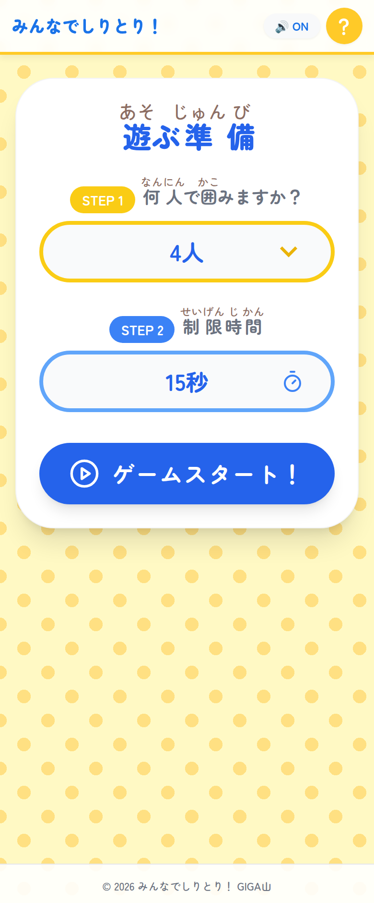

開いてすぐ出てくるのはこの画面だけです。人数と制限時間を選んで、大きなボタンを押すと始まります。

## 📱 このアプリでできること

まず、何人で囲むかを決めます。2人から6人まで選べます。次に制限時間を決めます。なし、10秒、15秒、20秒、30秒の五つから選びます。決めることはこの二つだけです。

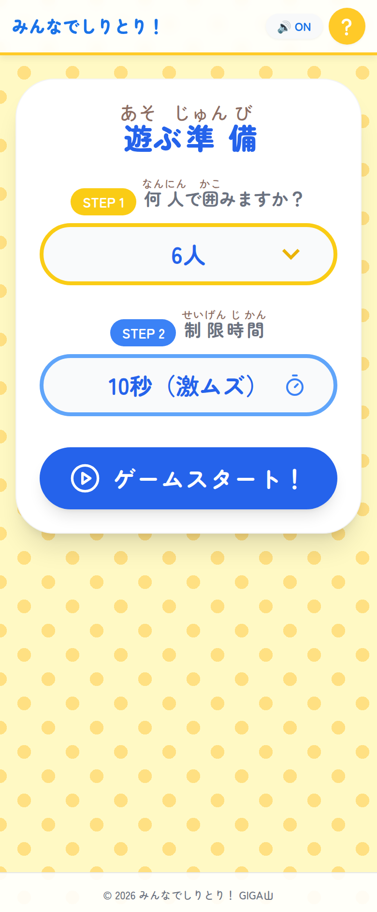

6人で10秒。いちばんにぎやかになる設定だと思います。

始めると、画面の真ん中に「今のお題」のカードが1枚出て、そのまわりに人数ぶんの手札が並びます。手札は1人5枚です。

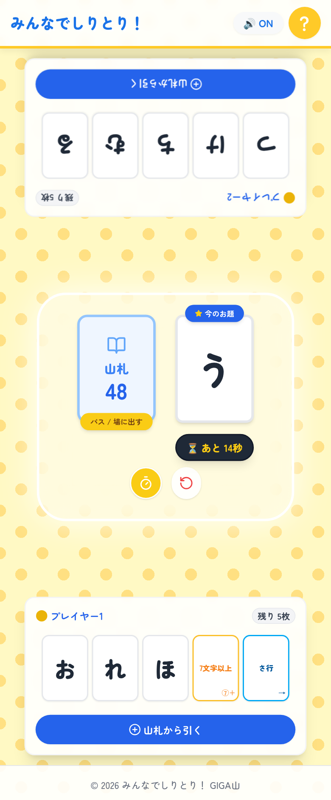

2人のときは向かい合う形になります。相手側の手札は上下がさかさまに表示されます。端末を机に置いて、向かいの子がそのまま読めるようにしてあります。

やることは一つだけです。真ん中のカードの文字で始まって、自分の手札のどれかの文字で終わる、3文字以上のことばを見つけて声に出します。言えたら、そのカードをタップします。

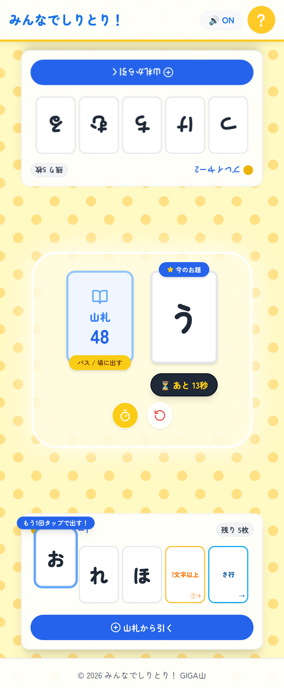

1回タップすると、そのカードだけが浮き上がって「もう1回タップで出す！」と出ます。まちがえて触っただけで場に出てしまわないように、2回に分けています。急いでいる子ほど画面のあちこちを触るので、ここは慎重にしました。急ぎたい子のために、カードを上へさっとはらう出しかたも用意してあります。

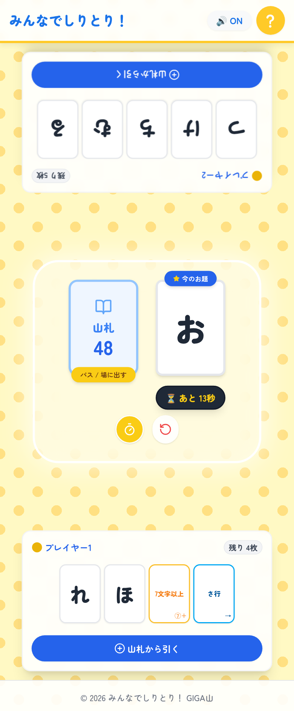

出したカードがそのまま次の「お題」になります。手札は1枚減ります。これをくり返して、いちばん早く手札をなくした人が勝ちです。

ことばは3文字以上と決めています。2文字を許すと「いえ」「うち」のような短いことばばかりが行き交って、思いつくのが速い子だけの遊びになってしまいます。3文字にすると、少し考える時間が生まれます。その数秒が、ほかの子が追いつくための時間になると思っています。

手札は5枚から始まります。3枚だと選べる文字が少なすぎて、手札を見た瞬間に「無理だ」と思う子が出ます。7枚だと画面に並べたときに小さくなりすぎます。5枚は、どの文字で終わるかを選べる余地があって、なおかつ一目で全部見わたせる枚数として決めました。

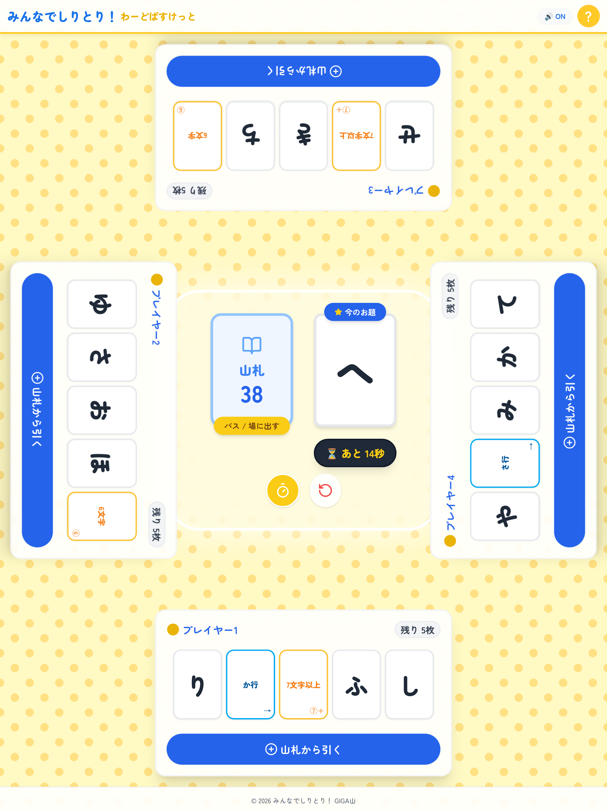

4人だと、タブレットの上下左右に手札が並びます。1台を机の真ん中に置いて、四方から囲む形です。

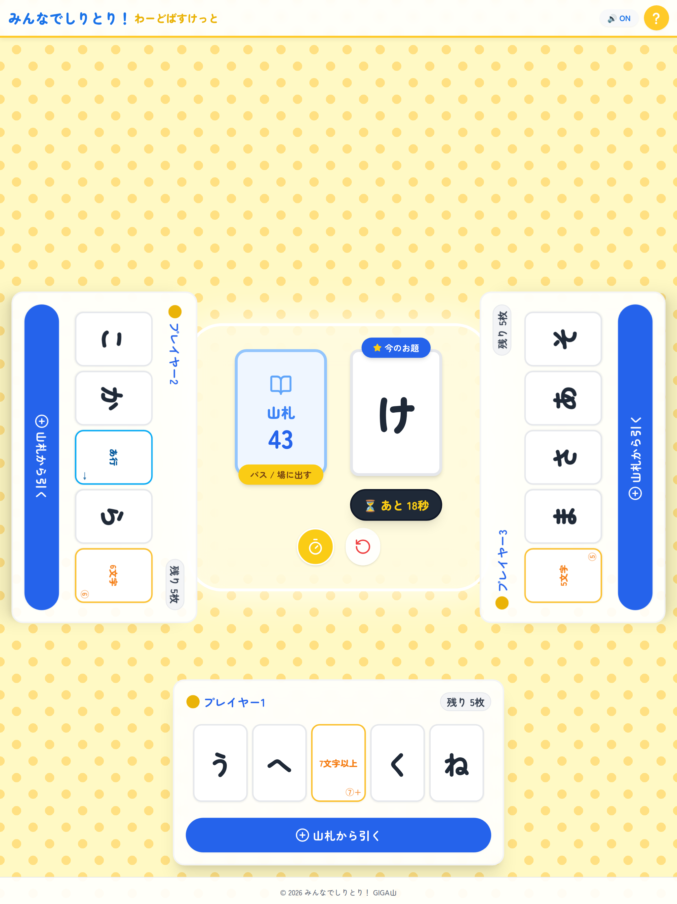

3人のときは手前と左右です。人数に合わせて座る場所が変わるので、余った場所ができません。

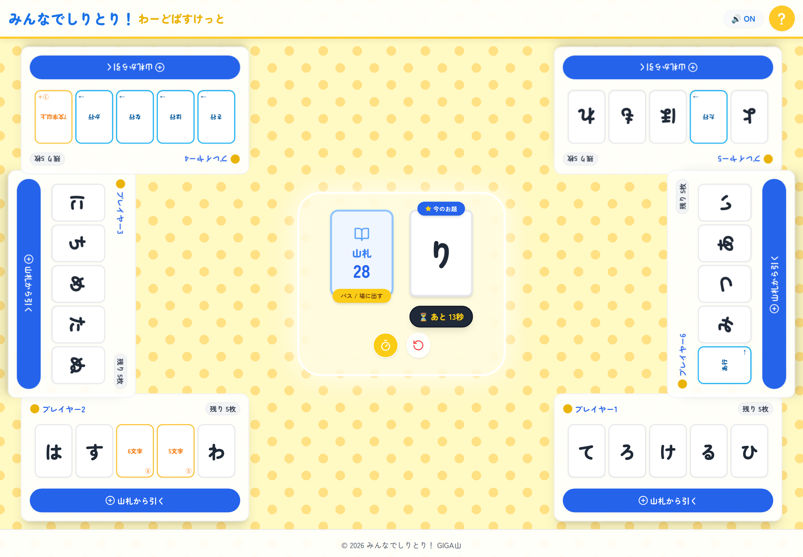

6人を横向きの画面で。大きなモニターやテレビにつなぐと、この形になります。班の6人で1台を囲む使いかたを想像して作りました。

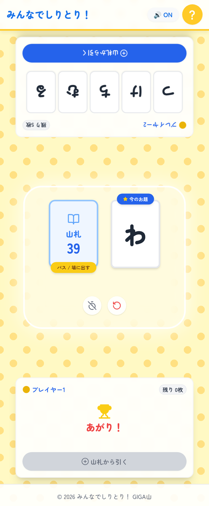

手札がなくなると、その人の場所にトロフィーと「あがり！」が出ます。勝った人が出たあとも画面はそのままなので、残った子で2位を決める遊びかたもできます。

## 🃏 「あ行」と「5文字」のカードが、ことば探しを急に楽しくします

カードは全部で59枚あります。中身は3種類です。

ひらがな1文字のカードが44枚。「あ」から「わ」までで、濁点や半濁点のつく文字も、小さく書く文字もありません。しりとりで終わりに来ない「ん」も入れていません。ここは迷ったところです。文字の種類を増やせば、出てくることばの幅は広がります。ただ、低学年の子が手札を見て「これで終わることばなんてあるのかな」と固まってしまうと、遊びが止まります。だから、思いつきやすい文字だけを残しました。

配ったあとに残るカードが山札になります。4人で遊ぶと、5枚ずつ配って場に1枚出すので、山札は38枚から始まります。この枚数が、パスを何回できるかの余裕になります。何度も詰まって何度もパスをしても、そうかんたんには尽きません。

そして特別なカードが15枚あります。これがこのゲームのいちばん面白いところだと思っています。

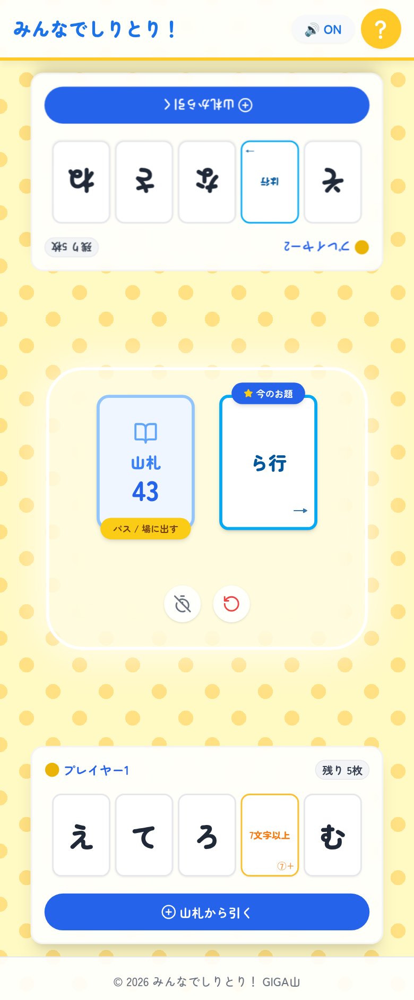

「ら行」のような行のカードが9枚。これがお題に出ると、ら、り、る、れ、ろのどれで始まってもよくなります。手札のほうに来れば、その行のどの文字で終わってもよくなります。急に選べる幅が広がるので、ことばが出てこなくて困っていた子にも順番が回ってきます。

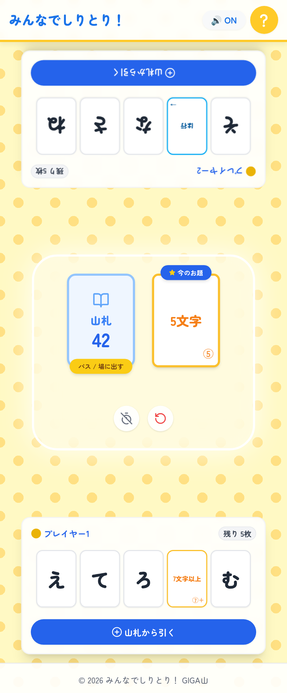

文字数のカードが6枚。5文字、6文字、7文字以上の3種類が2枚ずつです。これがお題に出ると、文字の縛りがなくなるかわりに、ちょうどその文字数のことばを言わなければいけません。「5文字ぴったり」を探すのは、大人でも急には出てきません。ここで教室の空気が変わると思っています。

こういうルールは、口で説明すると長くなります。だから画面のなかに置きました。右上のはてなマークを押すと、いつでも出てきます。

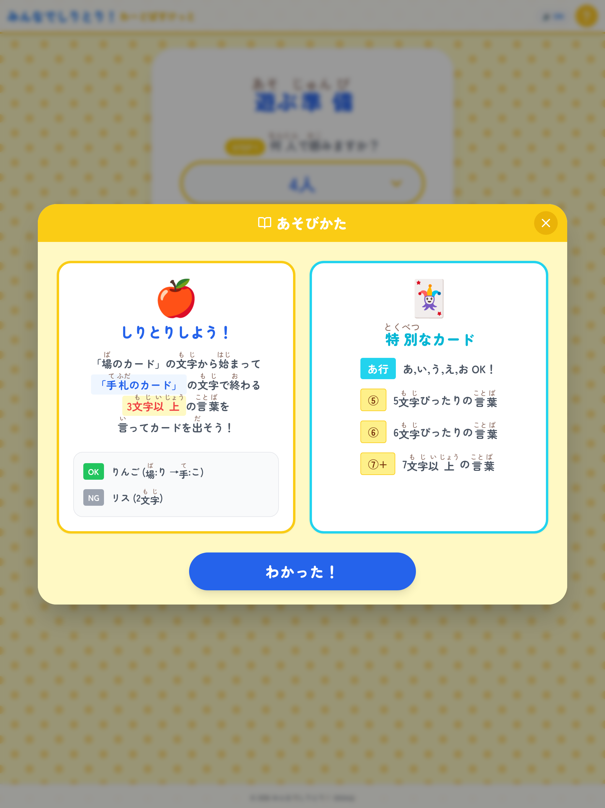

ふりがなをつけて、絵と色でわかるようにしました。低学年の子が自分で読んで思い出せる粒度をねらっています。

## ⏳ 秒読みと「パス」で、止まらないようにしました

このゲームでいちばん困るのは、全員がことばを思いつかずに止まってしまう場面です。順番がないので、誰も動かないと本当に何も起きません。そこで二つの仕掛けを入れました。

一つは制限時間です。お題のカードの下に残り時間が出ていて、少なくなると赤くなります。

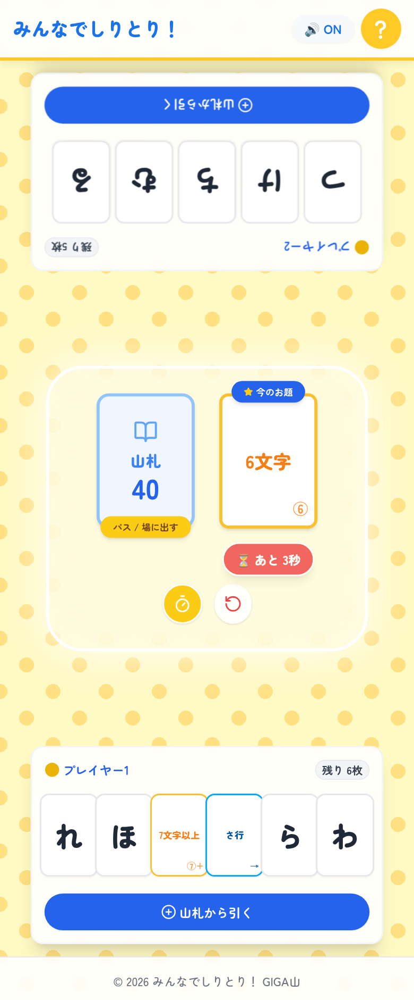

残り3秒からは色が変わって点滅します。読み上げなくても、目のすみで気づけるようにしています。

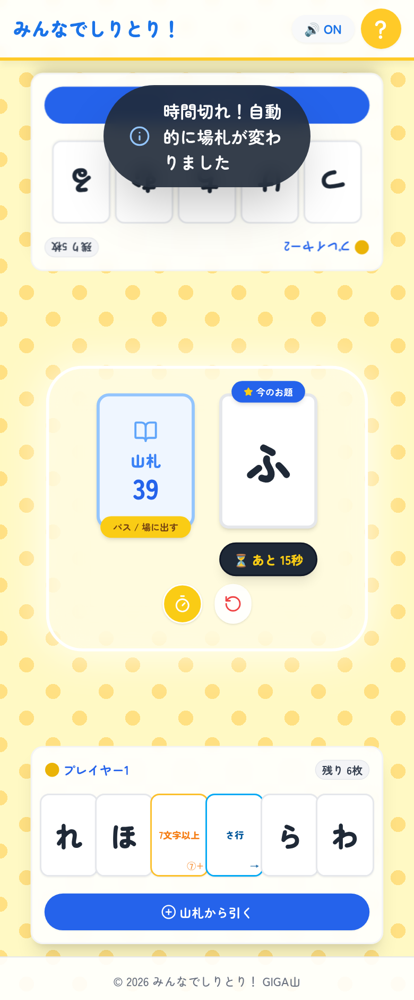

時間切れになると、山札から新しいカードが1枚めくられて、お題がひとりでに変わります。「はい、次」と声をかける役をアプリが引きうけてくれる形です。誰も責められないまま次に進むので、止まっても気まずくなりません。

もう一つは「パス」です。真ん中の山札を押すと、その場でお題を1枚めくり直せます。

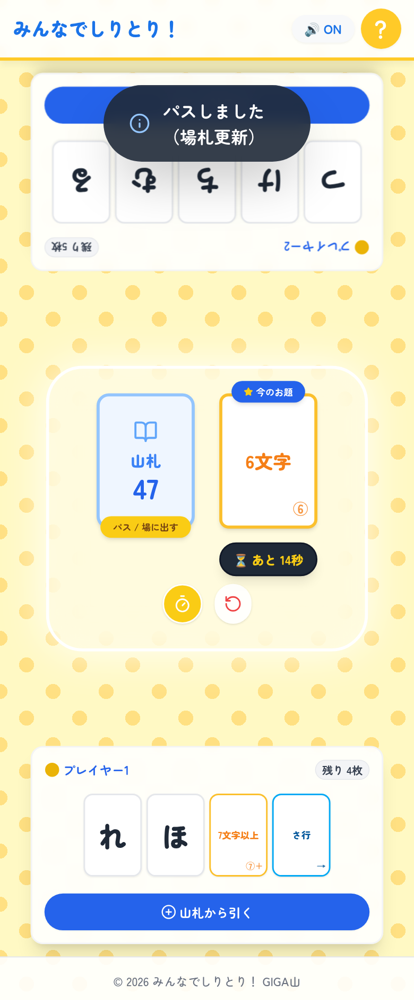

時間を待たずに次へ行けます。全員が顔を見合わせたまま10秒待つのはもったいないので、誰かが押せばいい形にしました。

手札を増やすこともできます。自分の場所にある「山札から引く」を押すと1枚もらえます。

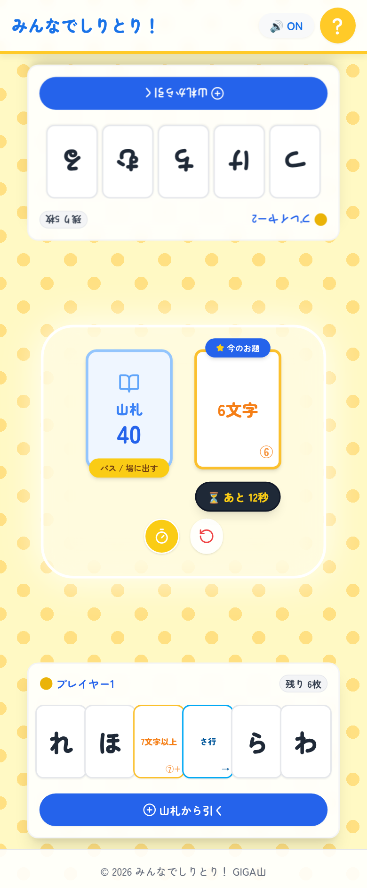

手札が増えると勝つのは遠のきますが、選べる文字が増えます。ことばが出てこなくて苦しい子が、自分で楽になる道を選べるようにしてあります。負けを認めるボタンではなく、遊びを続けるためのボタンとして置きました。

制限時間を「なし」にすることもできます。真ん中のタイマーのボタンを押せば、遊びの途中でも止められます。時間に追われるのが苦手な子がいる学級では、はじめは「なし」から入るのがよいかもしれません。

## ✨ 導入のメリット

三つのいいことが期待できます。

一つ目は、準備がいらないことです。カードを印刷して切る作業も、箱を出してくる手間もありません。リンクを開いて人数を選ぶだけなので、思いついてから遊びはじめるまでが1分もかかりません。空いた10分を、迷っているうちに使い切ってしまうことがなくなると思います。

二つ目は、待つ時間がなくなることです。順番がないので、全員がずっと考えています。ことばの得意な子が速く答えるのは変わりませんが、行のカードや文字数のカードが出たときには、ふだん手が挙がらない子にも先に思いつく番が回ってきます。誰が強いかが毎回入れ替わる作りなので、勝ち負けが固定されにくいと思っています。

三つ目は、先生が審判をしなくてよくなることです。時間切れとお題の入れ替えはアプリがやります。先生は輪の外から見ていられるので、うまくことばが出てきた子に「それいいね」と声をかけるほうに手が空きます。子どもたちのことばを聞く時間が増えるのが、いちばんうれしいところだと思っています。

ことばが正しいかどうかの判定は、あえてアプリに入れませんでした。辞書を持たせて機械に正誤を決めさせることもできましたが、そうすると「機械にはねられた」という体験が生まれます。それよりも、囲んでいる子どもたちが「それってことばなの」「それはありでしょ」と話し合うほうが、この遊びには合っていると思いました。ことばの数え方でもめたら、そこがいちばん学びのある場面だと思っています。

## 🛠️ 【管理者向け】導入手順

情報担当の先生に確認されることを、先にまとめておきます。

アプリの場所はここです。

https://word-basket.giga-school.com/

校内のフィルタリングを通す場合は、三つのアドレスを許可してください。アプリ本体がある word-basket.giga-school.com と、文字の形を読みこんでいる fonts.googleapis.com、fonts.gstatic.com です。あとの二つは見た目のためだけなので、通らなくても遊べます。文字の形が少し変わるだけです。

個人情報については、送るものも残すものもありません。名前やクラスを入力する場面がなく、遊んだ記録も、勝った回数も、設定した人数さえも端末に残りません。閉じればまっさらに戻ります。共用のタブレットを次の学級に渡すときに、消しておく作業はいりません。

通信をするのは、アプリを開くときだけです。遊んでいるあいだ、外へ何かを送ることはありません。端末同士がつながる作りでもないので、校内の無線が混んでいても動きます。

2回目からはオフラインで動きます。アプリを一度開いた端末では、画面のメニューから「ホーム画面に追加」や「アプリをインストール」を選んでおくと、ホーム画面のアイコンから全画面で起動できます。この状態なら、通信がまったくなくても遊べます。持ち帰り端末や、電波の届きにくい部屋でも使えます。

音は効果音だけです。カードを選んだとき、出したとき、時間切れになったときに短い音が鳴ります。音楽は流れません。それでも教室で複数台を同時に使うとうるさくなるので、画面の右上で切れるようにしてあります。

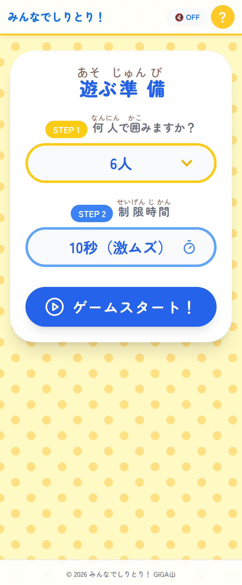

押すたびに切りかわります。切った状態のまま遊んでも、動きは何も変わりません。

端末は縦でも横でも使えます。画面の大きさに合わせて全体が自動で縮んだり広がったりするので、スマートフォンでも、タブレットでも、大型モニターにつないだパソコンでも、画面から見切れることがありません。人数が多いときは画面の大きい端末のほうが見やすいので、4人以上ならタブレット、2人ならスマートフォンでも十分だと思います。

一つだけ気をつけていただきたいのは、みんなで1台を囲む遊びだということです。それぞれの端末をつないで遊ぶ作りではありません。1人1台の環境でも、遊ぶときは机をくっつけて1台を囲む形になります。学級全体でやるなら、班ごとに1台を出して、6班なら6台で同時に走らせる使いかたになります。班ごとに別のゲームが進むので、進み方をそろえる必要もありません。

学級で複数台を同時に使うときは、音を切ってから配るほうが落ち着きます。1台なら効果音があったほうが盛り上がりますが、6台が別々に鳴ると何の音か分からなくなります。

漢字にはふりがなを振ってあります。「遊ぶ準備」「制限時間」「特別なカード」といった、遊ぶ準備の画面とあそびかたの画面の文字がそれです。遊んでいるあいだの画面は「今のお題」「山札」のような短い言葉だけにしてあります。1年生に渡しても、大人が読み上げずに進められる粒度をねらいました。

カードを1回タップでは出ないようにしたのは、共用の端末を想定したからです。何人もの手が同じ画面の上を行き来するので、うっかり触っただけでカードが出てしまうと、そのたびにもめます。2回に分ける作りにしたぶん、ひと手間は増えました。それでも「今のは違う、押してない」という言い合いが起きないほうを選びました。

## 📖 【利用者向け】使い方のガイド

遊びはじめる前に、一つだけ約束を決めておくとうまく回ると思います。カードを押すより先に、ことばを声に出すという約束です。押してから考えると、まわりの子は何のことばだったのか分かりません。声に出してから押す順番にしておけば、聞いていた子が「今のはいいね」と言えます。アプリはここを判定しないので、この約束だけが遊びの土台になります。

子どもたちに配るときの説明として、そのまま読める形で書いておきます。

1. リンクを開きます。「遊ぶ準備」の画面が出ます。
2. 「何人で囲みますか」で人数を選びます。囲んでいる人の数と合わせてください。
3. 「制限時間」を選びます。はじめてなら30秒か「なし」がおすすめです。慣れてきたら15秒、盛り上げたいときは10秒にします。
4. 「ゲームスタート！」を押します。端末を机の真ん中に置いて、みんなが自分の手札を見られる向きに座ります。
5. 真ん中の「今のお題」のカードを見ます。その文字から始まって、自分の手札のどれかの文字で終わる、3文字以上のことばを探します。
6. 見つけたら、まず声に出して言います。言ってから、そのカードを1回タップします。
7. 浮き上がったカードをもう1回タップすると、場に出ます。急ぐときは、カードを上へさっとはらっても出せます。
8. 出したカードが次のお題になります。同じことをくり返します。
9. 誰も思いつかないときは、真ん中の山札を押します。お題が新しいカードに変わります。
10. 手札にことばが作れる文字がないときは、自分の「山札から引く」を押して1枚もらいます。
11. 手札が全部なくなった人が勝ちです。「あがり！」と出ます。
12. もう一度遊ぶときは、真ん中の矢印のボタンを押して「はい」を選びます。

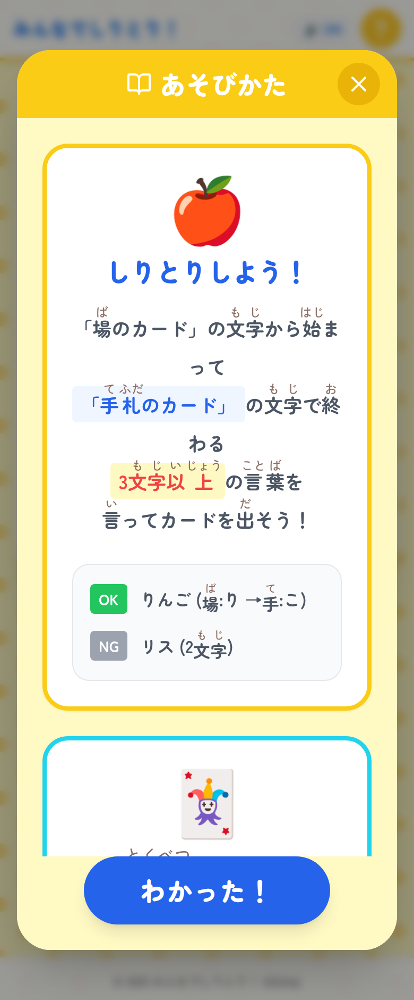

ルールを忘れたら、右上のはてなマークを押します。あそびかたが出てきます。

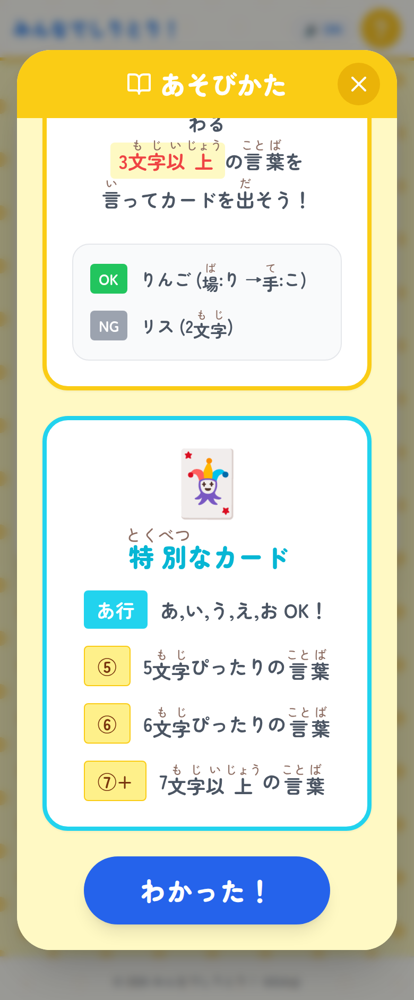

下のほうに、特別なカードの説明があります。「あ行」が出たときと「5文字」が出たときの見分けは、ここを見せるのがいちばん早いと思います。

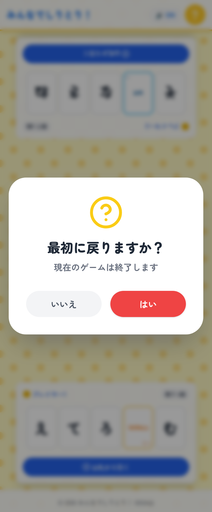

やり直しのボタンを押すと、いちど確認が出ます。遊んでいる途中でうっかり押しても、途中でやめてしまわないようにしてあります。

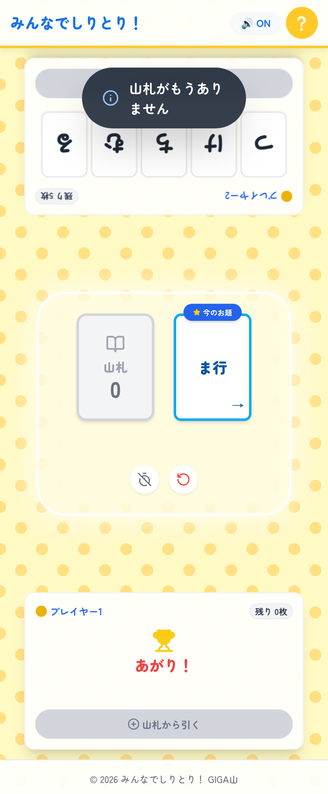

長く遊んで山札を使い切ると、山札の場所が灰色になって、パスも手札を増やすこともできなくなります。ここまで来たら、残っている手札だけで決着をつけるか、やり直しのボタンで新しく配り直してください。

## 📝 まとめ

このアプリを作っているあいだ、ずっと考えていたのは「先生が進行役をしなくても回るか」ということでした。

学級レクで何かをするとき、先生はたいてい司会をしています。順番を決めて、時間を計って、次の人に振って、判定をします。それをしているあいだは、子どもたちの様子を見ていられません。誰がどんなことばを思いついたのか、どの子が言いかけてやめたのか、いちばん見たいところを見のがしてしまいます。

順番がないゲームを選んだのは、そこを手放したかったからです。時間を計るのも、次のお題を出すのも、アプリがやります。先生は輪の外に立って、ただ聞いていられます。ICTを使って作りたかったのは速さや効率ではなく、この「見ていられる時間」でした。

だから、記録を残す機能はどれも入れませんでした。勝った回数も、何回遊んだかも、どの子が強いかも、どこにも残りません。閉じれば消えます。積み上がる数字があると、子どもたちはそれを追いかけはじめます。10分だけの遊びに、追いかけるものは必要ないと思いました。次に開いたときも、また同じところから始まればよいと考えています。

もし試してくださるなら、はじめは制限時間を「なし」にして、2人か3人の小さい輪から始めるのがよいと思います。ルールが身についてから人数と速さを上げると、同じアプリが別の遊びのように変わります。そのころには、子どもたちが自分たちで「10秒にしよう」と言い出しているかもしれません。

作ったものが教室でどう転がっていくかは、渡してみるまで分かりません。それでも、空いた10分に子どもたちの声が増えるなら、作った意味はあったと思えます。

一歩踏み出そうとする先生を、私はいつでも全力で応援しています。
